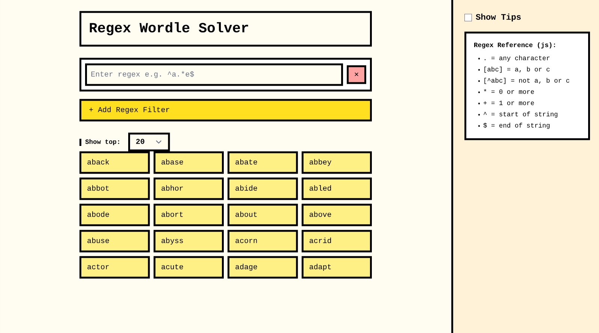
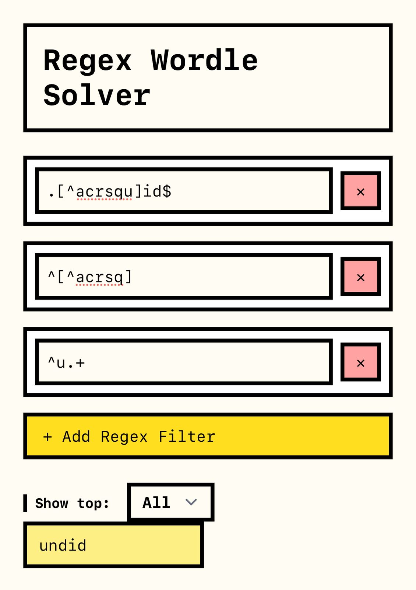

# Regex Wordle Solver

A minimal, regex-powered Wordle solver built with SvelteKit and Tailwind CSS.

This was originally a joke project created as a way to experiment with SvelteKit and to cheat on Discord Wordle games with my friends using
regular expressions. The app allows users to filter a curated word list using stacked regex queries in real time.




## Usage


```bash
bun install
bun dev
```

1. Enter one or more regex patterns to filter the Wordle wordlist
2. Use anchors like `^`, `$`, and wildcard characters to refine your match
3. Combine filters to quickly zero in on the correct word

## Future work
- PCRE support
- A game that lets you learn regex by playing Wordle